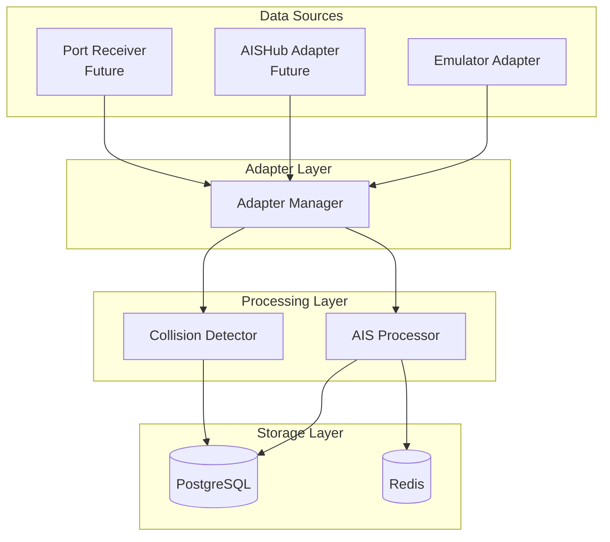
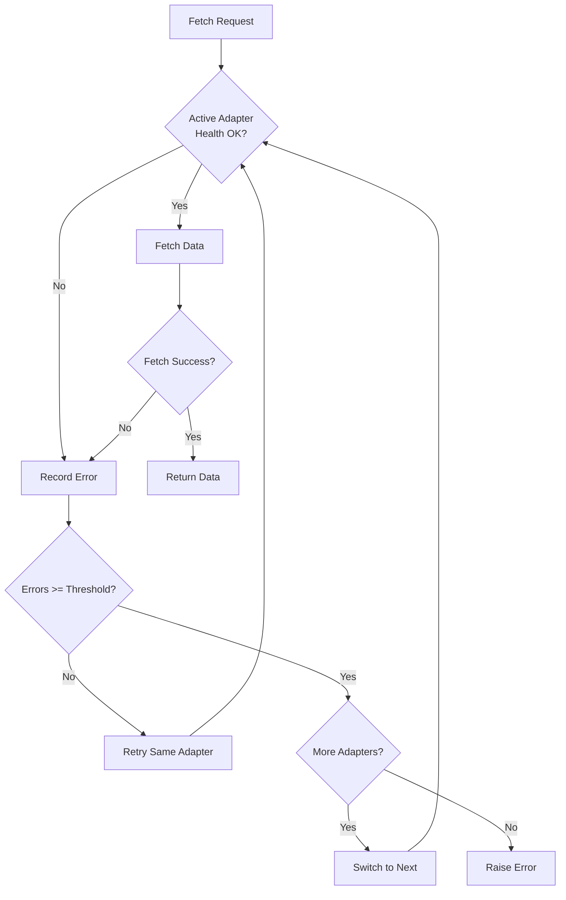
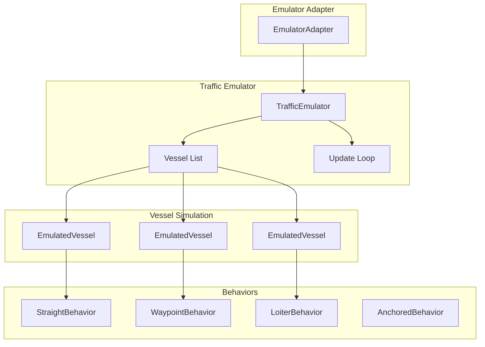
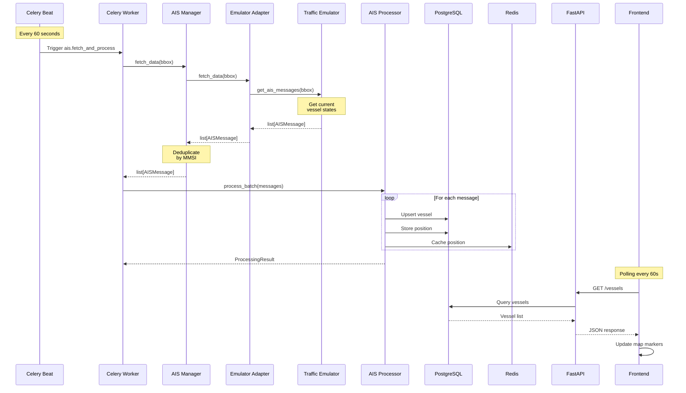
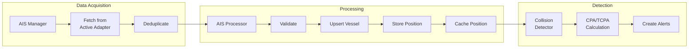
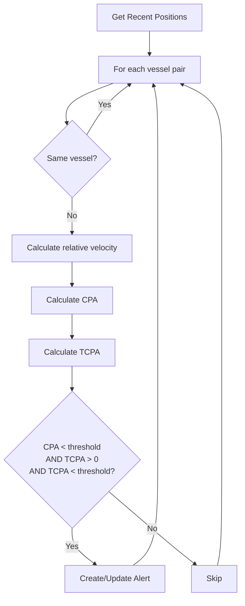

# Poseidon Maritime Security System - AIS Data Architecture

**Version:** 0.1.0
**Generated:** January 2026
**Status:** As-Built Documentation

---

## Table of Contents

1. [Overview](#overview)
2. [Adapter Pattern](#adapter-pattern)
3. [AIS Models](#ais-models)
4. [Adapter Manager](#adapter-manager)
5. [Emulator Design](#emulator-design)
6. [Scenario System](#scenario-system)
7. [Data Flow](#data-flow)
8. [Processing Pipeline](#processing-pipeline)

---

## Overview

The Poseidon MSS AIS (Automatic Identification System) architecture uses an **adapter pattern** to abstract data sources, allowing the system to seamlessly switch between different AIS data providers including:

- **Traffic Emulator**: Generates realistic vessel movements for development/testing
- **Real-time AIS feeds**: Future support for AISHub, port receivers, etc.

### Key Design Goals

1. **Source Agnostic**: Internal data models are independent of the data source
2. **Fault Tolerant**: Automatic failover between sources
3. **Flexible**: Easy to add new data sources
4. **Testable**: Emulator enables development without external dependencies

---

## Adapter Pattern

### Architecture Diagram



### Base Adapter Interface

All AIS data sources implement the `AISDataAdapter` abstract base class.

**File:** `backend/app/ais/adapters/base.py`

```python
class AISDataAdapter(ABC):
    """Abstract base class for all AIS data sources."""

    @abstractmethod
    async def fetch_data(self, bbox: Optional[BoundingBox] = None) -> list[AISMessage]:
        """Fetch AIS data from the source."""
        pass

    @abstractmethod
    async def health_check(self) -> bool:
        """Check if the data source is available and healthy."""
        pass

    @abstractmethod
    def get_source_info(self) -> SourceInfo:
        """Get metadata about this data source."""
        pass

    async def start(self) -> None:
        """Initialize the adapter (e.g., open connections)."""
        pass

    async def stop(self) -> None:
        """Cleanup the adapter (e.g., close connections)."""
        pass
```

### Adapter Interface Methods

| Method | Purpose | Returns |
|--------|---------|---------|
| `fetch_data(bbox)` | Retrieve AIS messages, optionally filtered by bounding box | `list[AISMessage]` |
| `health_check()` | Verify source availability | `bool` |
| `get_source_info()` | Get metadata and statistics | `SourceInfo` |
| `start()` | Initialize adapter (connections, emulator) | - |
| `stop()` | Cleanup resources | - |

### Helper Methods (Base Class)

| Method | Purpose |
|--------|---------|
| `_record_success(count, latency)` | Track successful fetch |
| `_record_error()` | Track failed fetch |
| `_get_average_latency()` | Calculate average response time |

### SourceInfo Data Class

Metadata about an AIS data source.

```python
@dataclass
class SourceInfo:
    name: str                          # Adapter name
    source_type: str                   # "emulator", "aishub", etc.
    is_active: bool                    # Currently active
    last_successful_fetch: datetime    # Last success time
    error_count: int                   # Consecutive errors
    total_messages_received: int       # Lifetime count
    average_latency_seconds: float     # Response time
    quality_score: float               # 0.0-1.0 data quality
    extra_info: dict                   # Source-specific metadata
```

---

## AIS Models

### AISMessage

Source-agnostic representation of an AIS position report.

**File:** `backend/app/ais/models.py`

```python
@dataclass
class AISMessage:
    # Required fields
    mmsi: int                              # 9-digit MMSI
    timestamp: datetime                     # Message timestamp
    latitude: float                        # -90 to 90
    longitude: float                       # -180 to 180

    # Navigation data
    speed_over_ground: Optional[float]     # Knots (0-102.2)
    course_over_ground: Optional[float]    # Degrees (0-360)
    heading: Optional[int]                 # Degrees (0-359)
    rate_of_turn: Optional[float]          # Degrees per minute
    navigation_status: Optional[NavigationStatus]

    # Vessel static data
    vessel_name: Optional[str]
    vessel_type: Optional[VesselType]
    vessel_type_code: Optional[int]
    call_sign: Optional[str]
    imo_number: Optional[int]

    # Dimensions
    length: Optional[float]                # Meters
    width: Optional[float]                 # Meters
    draft: Optional[float]                 # Meters

    # Voyage data
    destination: Optional[str]
    eta: Optional[datetime]

    # Quality metadata
    position_accuracy: str = "L"           # H=high (<10m), L=low
    source: str = "unknown"
    source_quality: float = 1.0            # 0.0-1.0
    raw_message: Optional[str] = None
    received_at: datetime = field(default_factory=datetime.utcnow)
```

### NavigationStatus Enum

AIS navigation status codes (0-15).

| Code | Status |
|------|--------|
| 0 | Under way using engine |
| 1 | At anchor |
| 2 | Not under command |
| 3 | Restricted manoeuvrability |
| 4 | Constrained by draught |
| 5 | Moored |
| 6 | Aground |
| 7 | Engaged in fishing |
| 8 | Under way sailing |
| 9 | Reserved for HSC |
| 10 | Reserved for WIG |
| 11-13 | Reserved |
| 14 | AIS-SART active |
| 15 | Not defined |

### VesselType Enum

Simplified vessel type categories derived from AIS ship type codes.

| Category | AIS Codes |
|----------|-----------|
| `CARGO` | 70-79 |
| `TANKER` | 80-89 |
| `PASSENGER` | 60-69 |
| `FISHING` | 30 |
| `MILITARY` | 35 |
| `PLEASURE_CRAFT` | 36-37 |
| `HIGH_SPEED_CRAFT` | 40-49 |
| `TUG` | 31-32 |
| `PILOT_VESSEL` | 50 |
| `SEARCH_AND_RESCUE` | 51 |
| `DREDGER` | 33 |
| `LAW_ENFORCEMENT` | 55 |
| `SAILING` | 36 |
| `OTHER` | Others |
| `UNKNOWN` | 0, null |

### BoundingBox

Geographic bounding box for spatial filtering.

```python
@dataclass
class BoundingBox:
    min_lat: float  # -90 to 90
    max_lat: float  # -90 to 90
    min_lon: float  # -180 to 180
    max_lon: float  # -180 to 180

    def contains(self, latitude: float, longitude: float) -> bool:
        """Check if a point is within the bounding box."""
```

---

## Adapter Manager

The `AISAdapterManager` orchestrates multiple data sources with automatic failover.

**File:** `backend/app/ais/manager.py`

### Features

- **Priority-based sources**: Primary, secondary, tertiary
- **Automatic failover**: Switch sources after N consecutive failures
- **Message deduplication**: Keep highest quality message per MMSI
- **Health monitoring**: Track source availability
- **Statistics tracking**: Fetches, messages, failovers, uptime

### Configuration

```python
manager = AISAdapterManager(
    primary_adapter=emulator_adapter,
    secondary_adapter=aishub_adapter,     # Optional
    tertiary_adapter=port_adapter,        # Optional
    failover_threshold=3,                 # Failures before switch
)
```

### Key Methods

| Method | Purpose |
|--------|---------|
| `start_all()` | Initialize all adapters |
| `stop_all()` | Shutdown all adapters |
| `fetch_data(bbox)` | Fetch from active source with failover |
| `switch_adapter(name)` | Manual adapter switch |
| `get_all_source_info()` | Status of all sources |
| `health_check_all()` | Health status map |
| `get_statistics()` | Manager statistics |

### Failover Logic



### Statistics

```python
manager.get_statistics()
# Returns:
{
    "is_started": True,
    "adapter_count": 1,
    "active_adapter": "emulator",
    "active_adapter_index": 0,
    "total_fetches": 150,
    "total_messages": 2250,
    "failover_count": 0,
    "uptime_seconds": 9000.0,
    "adapters": [
        {
            "name": "emulator",
            "is_enabled": True,
            "is_started": True,
            "error_count": 0
        }
    ]
}
```

### Global Instance

```python
from app.ais.manager import get_ais_manager, set_ais_manager

# Get global instance
manager = get_ais_manager()

# Set global instance (during startup)
set_ais_manager(new_manager)
```

---

## Emulator Design

The traffic emulator generates realistic vessel movements for development and testing.

### Architecture



### TrafficEmulator Class

**File:** `backend/app/emulator/engine.py`

The main orchestrator for vessel simulation.

```python
class TrafficEmulator:
    def __init__(self, update_interval: int = 30):
        self.vessels: list[EmulatedVessel] = []
        self.scenario: Optional[Scenario] = None
        self.is_running = False
        self.update_interval = update_interval  # seconds
```

### Key Methods

| Method | Purpose |
|--------|---------|
| `load_scenario(scenario)` | Load predefined scenario |
| `generate_random_traffic(n, bbox)` | Generate random vessels |
| `add_vessel(vessel)` | Add vessel to simulation |
| `remove_vessel(mmsi)` | Remove vessel by MMSI |
| `start()` | Start simulation loop |
| `stop()` | Stop simulation |
| `update_positions()` | Calculate new positions |
| `get_ais_messages(bbox)` | Get current vessel states |
| `get_statistics()` | Get emulator stats |

### EmulatedVessel Class

**File:** `backend/app/emulator/vessel.py`

Represents a single simulated vessel.

```python
class EmulatedVessel:
    mmsi: int
    name: str
    vessel_type: VesselType
    latitude: float
    longitude: float
    speed: float           # Knots
    course: float          # Degrees
    heading: float         # Degrees
    is_transmitting: bool  # AIS on/off
    _behavior: VesselBehavior
```

### Vessel Behaviors

**File:** `backend/app/emulator/behaviors.py`

| Behavior | Description |
|----------|-------------|
| `StraightBehavior` | Move in a straight line at constant speed/course |
| `WaypointBehavior` | Follow a list of waypoints, optionally looping |
| `LoiterBehavior` | Circle around a point (simulates fishing, waiting) |
| `AnchoredBehavior` | Stationary with minor drift |
| `SuspiciousBehavior` | Erratic movements for anomaly scenarios |

### Default Bounding Box

The default simulation area is Thermaikos Gulf (sea south of Thessaloniki):

```python
THESSALONIKI_BBOX = BoundingBox(
    min_lat=40.50,  # Southern part of gulf
    max_lat=40.60,  # Just south of port
    min_lon=22.80,  # Western part
    max_lon=22.98,  # Eastern part
)
```

### Emulator Adapter

**File:** `backend/app/ais/adapters/emulator.py`

Wraps the TrafficEmulator as an AIS adapter.

```python
class EmulatorAdapter(AISDataAdapter):
    """Traffic emulator adapter for development and testing."""

    async def start(self):
        """Initialize and start the emulator."""
        self.emulator = TrafficEmulator(update_interval=self.update_interval)

        if self.scenario_file:
            scenario = load_scenario(self.scenario_file)
            await self.emulator.load_scenario(scenario)
        else:
            await self.emulator.generate_random_traffic(
                self.num_vessels, self.default_bbox
            )

        await self.emulator.start()

    async def fetch_data(self, bbox=None) -> list[AISMessage]:
        """Get current emulated vessel positions."""
        return await self.emulator.get_ais_messages(bbox=bbox)
```

### Adapter Configuration

```python
config = {
    "name": "emulator",
    "scenario_file": "scenarios/thessaloniki_normal_traffic.yaml",  # Optional
    "num_vessels": 50,                # If no scenario
    "update_interval_seconds": 30,
    "default_bbox": {
        "min_lat": 40.50,
        "max_lat": 40.60,
        "min_lon": 22.80,
        "max_lon": 22.98,
    }
}
```

---

## Scenario System

Scenarios define predefined vessel configurations for testing specific situations.

### Scenario File Format (YAML)

**Location:** `scenarios/`

```yaml
name: "Scenario Name"
description: "Description of the scenario"
duration_minutes: 180
update_interval: 30

bounding_box:
  min_lat: 40.50
  max_lat: 40.60
  min_lon: 22.80
  max_lon: 22.98

vessels:
  - mmsi: 239000001
    name: "VESSEL NAME"
    type: "cargo"                    # Vessel type
    start_position: [40.52, 22.85]   # [lat, lon]
    speed: 8.0                       # Knots
    course: 45                       # Degrees
    behavior: "straight"             # Behavior type
    length: 180.0                    # Optional dimensions
    width: 28.0
    draft: 9.5
    destination: "PORT NAME"
    flag_state: "GR"

  - mmsi: 239000002
    name: "WAYPOINT VESSEL"
    type: "passenger"
    start_position: [40.53, 22.86]
    speed: 15.0
    course: 90
    behavior: "waypoints"
    waypoints:
      - [40.54, 22.88]
      - [40.55, 22.90]
      - [40.54, 22.88]
    loop: true                       # Loop through waypoints

  - mmsi: 239000003
    name: "FISHING BOAT"
    type: "fishing"
    start_position: [40.51, 22.84]
    speed: 0.5
    course: 45
    behavior: "loiter"
    loiter_radius: 0.02              # Degrees

metadata:
  author: "Poseidon MSS"
  created: "2024-01-12"
  version: "1.0"
  tags: ["development", "normal"]
```

### Available Scenarios

| Scenario | Description | Vessels |
|----------|-------------|---------|
| `thessaloniki_normal_traffic.yaml` | Normal port operations | 20 |
| `collision_threat.yaml` | Vessels on collision course | 6 |
| `ais_gap_dark_vessel.yaml` | AIS signal gaps | - |
| `loitering_suspicious.yaml` | Suspicious loitering | - |
| `zone_violation.yaml` | Security zone violations | - |

### Vessel Types

| Type | Description |
|------|-------------|
| `cargo` | Cargo ships (70-79) |
| `tanker` | Oil/chemical tankers (80-89) |
| `passenger` | Ferries, cruise ships (60-69) |
| `fishing` | Fishing vessels (30) |
| `tug` | Tugboats (31-32) |
| `pilot_vessel` | Pilot boats (50) |
| `pleasure_craft` | Yachts, recreational (36-37) |
| `military` | Military vessels (35) |
| `sailing` | Sailing vessels (36) |
| `high_speed_craft` | HSC, ferries (40-49) |

### Behavior Types

| Behavior | Parameters | Description |
|----------|------------|-------------|
| `straight` | - | Constant speed and course |
| `waypoints` | `waypoints`, `loop` | Follow waypoint list |
| `loiter` | `loiter_radius` | Circle around position |
| `anchored` | - | Stationary with drift |
| `suspicious` | - | Erratic movements |

### Loading Scenarios

**Via API:**
```
POST /api/v1/ais-sources/emulator/load-scenario/thessaloniki_normal_traffic
```

**Via Code:**
```python
from app.emulator.scenarios import load_scenario

scenario = load_scenario("scenarios/thessaloniki_normal_traffic.yaml")
await emulator.load_scenario(scenario)
```

---

## Data Flow

### Complete Data Flow Diagram



### Ingestion Pipeline



### Update Cycle Timing

| Operation | Frequency | Purpose |
|-----------|-----------|---------|
| Position update (emulator) | 30 seconds | Update vessel positions |
| AIS fetch & process | 60 seconds | Ingest data to database |
| Collision detection | 30 seconds | CPA/TCPA calculations |
| Risk score update | 5 minutes | Update vessel risk scores |
| Position cleanup | Daily 3 AM | Delete old positions |

---

## Processing Pipeline

### AIS Processor

**File:** `backend/app/ais/processor.py`

Processes AIS messages into database records.

```python
class AISMessageProcessor:
    """Processes AIS messages into database records."""

    async def process_message(self, message: AISMessage) -> bool:
        """Process a single AIS message."""

    async def process_batch(self, messages: list[AISMessage]) -> ProcessingResult:
        """Process a batch of AIS messages."""
```

### Processing Steps

1. **Validate Message**: Check MMSI format, coordinates
2. **Upsert Vessel**: Create or update vessel record
3. **Store Position**: Insert position with PostGIS geography
4. **Cache Position**: Store in Redis for quick access
5. **Update Risk Score**: Recalculate if needed

### Collision Detection

**File:** `backend/app/ais/collision_detection.py`

Calculates CPA (Closest Point of Approach) and TCPA (Time to CPA).

```python
async def detect_collisions(
    cpa_threshold_nm: float = 0.5,
    tcpa_threshold_min: float = 30.0
) -> CollisionDetectionResult:
    """
    Detect potential collision risks between vessel pairs.

    Args:
        cpa_threshold_nm: CPA threshold in nautical miles
        tcpa_threshold_min: TCPA threshold in minutes

    Returns:
        CollisionDetectionResult with detected risks
    """
```

### CPA/TCPA Calculation



### Celery Task Integration

```python
# tasks/ais_ingestion.py

@celery_app.task(name="ais.fetch_and_process")
def fetch_and_process_ais_data(
    min_lat: float = 40.48,
    max_lat: float = 40.65,
    min_lon: float = 22.78,
    max_lon: float = 23.00,
) -> dict:
    """Fetch AIS data and process into database."""

@celery_app.task(name="ais.detect_collisions")
def detect_collisions(
    cpa_threshold_nm: float = 0.5,
    tcpa_threshold_min: float = 30.0,
) -> dict:
    """Detect collision risks between vessels."""
```

---

## Redis Caching

### Cache Key Structure

| Key Pattern | TTL | Purpose |
|-------------|-----|---------|
| `vessel:pos:{mmsi}` | 5 min | Latest position |
| `vessel:static:{mmsi}` | 1 hour | Vessel static data |
| `zone:{id}` | 30 min | Zone geometry |

### Position Cache Format

```python
{
    "mmsi": "237583000",
    "latitude": 40.6234,
    "longitude": 22.9456,
    "speed": 12.5,
    "course": 45.2,
    "heading": 44,
    "timestamp": "2025-01-14T12:30:00Z"
}
```

---

*This document reflects the actual implemented AIS architecture as of the documentation date.*
