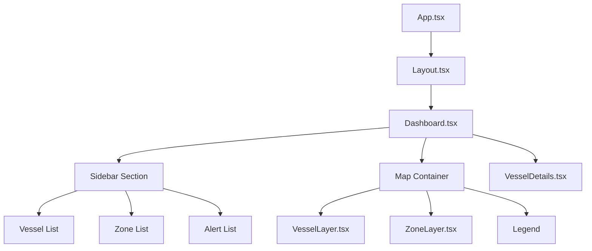

# Poseidon Maritime Security System - Frontend Documentation

**Version:** 0.1.0
**Generated:** January 2026
**Status:** As-Built Documentation

---

## Table of Contents

1. [Overview](#overview)
2. [Technology Stack](#technology-stack)
3. [Project Structure](#project-structure)
4. [Component Hierarchy](#component-hierarchy)
5. [State Management](#state-management)
6. [API Integration](#api-integration)
7. [Map Implementation](#map-implementation)
8. [Styling](#styling)
9. [Configuration](#configuration)

---

## Overview

The Poseidon MSS frontend is a React 18 single-page application (SPA) built with TypeScript and Vite. It provides an interactive map-based interface for vessel tracking, security zone visualization, and alert management.

### Key Features

- Interactive Mapbox GL map with vessel markers
- **Real-time vessel position updates via WebSocket**
- **Real-time collision alerts via WebSocket**
- Security zone visualization with GeoJSON
- Vessel details panel with comprehensive information
- Alert notification display
- Responsive sidebar with vessel/zone lists
- Connection status indicator in header

---

## Technology Stack

### Core Framework

| Package | Version | Purpose |
|---------|---------|---------|
| react | ^18.2.0 | UI framework |
| react-dom | ^18.2.0 | DOM rendering |
| react-router-dom | ^6.21.3 | Client-side routing |
| typescript | ^5.3.3 | Type safety |

### Build Tools

| Package | Version | Purpose |
|---------|---------|---------|
| vite | ^5.0.12 | Build tool & dev server |
| @vitejs/plugin-react | ^4.2.1 | React plugin for Vite |

### State & Data

| Package | Version | Purpose |
|---------|---------|---------|
| @tanstack/react-query | ^5.17.19 | Server state management |
| zustand | ^4.5.0 | Client state management |
| axios | ^1.6.7 | HTTP client |

### Map & UI

| Package | Version | Purpose |
|---------|---------|---------|
| mapbox-gl | ^3.1.2 | Map rendering |
| tailwindcss | ^3.4.1 | Utility-first CSS |
| clsx | ^2.1.0 | Conditional class names |
| tailwind-merge | ^2.2.1 | Merge Tailwind classes |

### Real-time

| Package | Version | Purpose |
|---------|---------|---------|
| socket.io-client | ^4.7.4 | WebSocket client for real-time updates |

---

## Project Structure

```
frontend/
├── src/
│   ├── components/           # Reusable UI components
│   │   ├── Map/
│   │   │   ├── index.ts      # Map barrel export
│   │   │   ├── VesselLayer.tsx  # Vessel markers layer
│   │   │   └── ZoneLayer.tsx    # Security zones layer
│   │   ├── Layout.tsx        # Main app layout
│   │   └── VesselDetails.tsx # Vessel info panel
│   │
│   ├── pages/                # Page components
│   │   └── Dashboard.tsx     # Main dashboard page
│   │
│   ├── hooks/                # Custom React hooks
│   │   ├── useVessels.ts     # Vessel data fetching
│   │   ├── useZones.ts       # Zone data fetching
│   │   └── useSocket.ts      # WebSocket connection
│   │
│   ├── stores/               # Zustand state stores
│   │   ├── useVesselStore.ts # Vessel/alert state
│   │   └── useMapStore.ts    # Map UI state
│   │
│   ├── lib/                  # Utilities
│   │   └── api.ts            # API client functions
│   │
│   ├── types/                # TypeScript types
│   │   └── index.ts          # Shared type definitions
│   │
│   ├── App.tsx               # Root component with routing
│   ├── main.tsx              # Application entry point
│   └── vite-env.d.ts         # Vite type declarations
│
├── public/                   # Static assets
├── package.json              # Dependencies
├── vite.config.ts            # Vite configuration
├── tsconfig.json             # TypeScript configuration
├── tailwind.config.js        # Tailwind CSS configuration
├── postcss.config.js         # PostCSS configuration
└── Dockerfile                # Container build
```

---

## Component Hierarchy



### Component Descriptions

#### App.tsx

Root component that sets up React Router and initializes the WebSocket connection.

```tsx
function App() {
  // Initialize WebSocket connection for real-time updates
  useSocket();

  return (
    <Routes>
      <Route path="/" element={<Layout />}>
        <Route index element={<Dashboard />} />
      </Route>
    </Routes>
  );
}
```

#### Layout.tsx

Main layout wrapper providing the application shell.

#### Dashboard.tsx

Primary page component containing:
- Sidebar with vessel/zone/alert lists
- Mapbox GL map container
- Vessel details slide-out panel
- Map legend

**Key Features:**
- Initializes Mapbox map instance
- Manages vessel selection state
- Coordinates data fetching with hooks
- Handles vessel click interactions

#### VesselLayer.tsx

Mapbox layer component for vessel visualization.

**Features:**
- Converts vessels to GeoJSON FeatureCollection
- Creates dynamic SVG vessel icons by type
- Rotates icons based on heading
- Handles vessel click events
- Highlights selected vessel

**Layer Structure:**
| Layer ID | Type | Purpose |
|----------|------|---------|
| `vessels` | GeoJSON Source | Vessel data |
| `vessel-markers` | Symbol | Vessel icons with rotation |
| `vessel-selected` | Circle | Selection highlight ring |

#### ZoneLayer.tsx

Mapbox layer component for security zone visualization.

**Features:**
- Renders GeoJSON polygon zones
- Colors by security level
- Shows zone labels
- Displays zone boundaries

#### VesselDetails.tsx

Slide-out panel showing detailed vessel information.

**Sections:**
- Vessel name and type (with color indicator)
- Identification (MMSI, IMO, call sign, flag)
- Position (lat/lon, last seen)
- Navigation (speed, course, heading)
- Voyage (destination, ETA)
- Dimensions (length, width, draught)
- Risk assessment (score, category)

---

## State Management

### Zustand Stores

#### useVesselStore

Manages vessel data and alerts for real-time updates.

```typescript
interface VesselState {
  vessels: Map<string, Vessel>;
  selectedVessel: string | null;
  alerts: Alert[];
  isConnected: boolean;

  // Actions
  setVessels: (vessels: Vessel[]) => void;
  updateVessel: (vessel: Vessel) => void;
  selectVessel: (mmsi: string | null) => void;
  addAlert: (alert: Alert) => void;
  acknowledgeAlert: (alertId: string) => void;
  setConnected: (connected: boolean) => void;
}
```

**Usage:**
```typescript
const vessels = useVesselStore((state) => state.vessels);
const selectVessel = useVesselStore((state) => state.selectVessel);
```

#### useMapStore

Manages map UI state and viewport.

```typescript
interface MapState {
  bounds: BoundingBox | null;
  selectedVesselMmsi: string | null;
  center: [number, number];  // [lng, lat]
  zoom: number;
  isDetailsPanelOpen: boolean;

  // Actions
  setBounds: (bounds: BoundingBox | null) => void;
  selectVessel: (mmsi: string | null) => void;
  setCenter: (center: [number, number]) => void;
  setZoom: (zoom: number) => void;
  setDetailsPanelOpen: (open: boolean) => void;
}
```

**Default Values:**
- Center: `[22.9444, 40.6401]` (Thessaloniki)
- Zoom: `11`

### React Query

Server state is managed with TanStack React Query.

#### Query Keys

```typescript
// Vessel queries
vesselKeys.all           // ['vessels']
vesselKeys.list(params)  // ['vessels', 'list', params]
vesselKeys.detail(mmsi)  // ['vessels', 'detail', mmsi]
vesselKeys.track(mmsi)   // ['vessels', 'track', mmsi, params]

// Zone queries
zoneKeys.all             // ['zones']
zoneKeys.list(params)    // ['zones', 'list', params]
zoneKeys.detail(id)      // ['zones', 'detail', id]
```

#### Caching Strategy

| Data Type | Stale Time | Refetch | Update Method |
|-----------|------------|---------|---------------|
| Vessels | Infinity | Initial only | WebSocket `vessel:update` |
| Zones | 5 minutes | 5 minutes | Polling |
| Vessel Track | 60 seconds | On demand | API request |
| Alerts | - | - | WebSocket `alert:new` |

**Note:** Vessel data is fetched once on initial load, then updated in real-time via WebSocket. No polling is used for vessel positions.

---

## API Integration

### API Client (lib/api.ts)

Centralized Axios client with base configuration.

```typescript
const api = axios.create({
  baseURL: '/api/v1',
  headers: {
    'Content-Type': 'application/json',
  },
});
```

### API Functions

#### Vessel API

```typescript
// Fetch vessel list with filtering
fetchVessels(params?: FetchVesselsParams): Promise<VesselsResponse>

// Fetch single vessel details
fetchVessel(mmsi: string): Promise<VesselDetails>

// Fetch vessel track history
fetchVesselTrack(mmsi: string, params?: FetchVesselTrackParams): Promise<VesselTrack>
```

#### Zone API

```typescript
// Fetch zones with filtering
fetchZones(params?: { zoneType?: string; activeOnly?: boolean; securityLevel?: number }): Promise<ZoneListResponse>

// Fetch single zone
fetchZone(zoneId: string): Promise<Zone>
```

#### AIS Source API

```typescript
// Get source status
fetchAISSourceStatus(): Promise<AISSourceStatus>

// List scenarios
fetchScenarios(): Promise<{ scenarios: ScenarioInfo[] }>

// Load scenario
loadScenario(name: string): Promise<{ message: string }>
```

#### Other API

```typescript
// Fetch alerts
fetchAlerts(): Promise<Alert[]>

// Health check
fetchHealth(): Promise<HealthResponse>
```

### Custom Hooks

#### useSocket

Establishes and manages the WebSocket connection for real-time updates.

```typescript
function useSocket(): Socket | null
```

**Connection:**
- Connects directly to backend at `http://localhost:8000`
- Uses Socket.IO with WebSocket and polling transports
- Auto-reconnects on disconnect

**Events Handled:**
| Event | Action |
|-------|--------|
| `connect` | Sets `isConnected` to true in store |
| `disconnect` | Sets `isConnected` to false in store |
| `vessel:update` | Calls `updateVessel()` in store |
| `alert:new` | Calls `addAlert()` in store |

**Usage:**
```typescript
// Called once in App.tsx to initialize connection
useSocket();

// Connection status available from store
const isConnected = useVesselStore((state) => state.isConnected);
```

---

#### useVessels

```typescript
// Fetch vessels with auto-refresh
function useVessels(params?: FetchVesselsParams): UseQueryResult<VesselsResponse>

// Fetch vessels within bounding box
function useVesselsInBounds(bbox: BoundingBox | null, enabled?: boolean): UseQueryResult<VesselsResponse>

// Fetch single vessel
function useVessel(mmsi: string | null): UseQueryResult<VesselDetails>

// Fetch vessel track
function useVesselTrack(mmsi: string | null, params?: FetchVesselTrackParams): UseQueryResult<VesselTrack>
```

#### useZones

```typescript
// Fetch zones with filtering
function useZones(params?: ZoneParams): UseQueryResult<ZoneListResponse>

// Fetch active zones only
function useActiveZones(): UseQueryResult<ZoneListResponse>

// Fetch single zone
function useZone(zoneId: string | null): UseQueryResult<Zone>
```

---

## Map Implementation

### Mapbox GL Configuration

**Map Style:** `mapbox://styles/mapbox/dark-v11`

**Default View:**
- Center: `[22.88, 40.55]` (Thermaikos Gulf)
- Zoom: `11`

**Controls:**
- Navigation control (zoom/rotation) - top-right
- Scale control - bottom-left

### Vessel Visualization

**Icon Generation:**

Vessels are rendered as arrow/triangle icons that rotate based on heading.

```typescript
function createVesselIcon(color: string, size = 24): string {
  const svg = `
    <svg xmlns="http://www.w3.org/2000/svg" width="${size}" height="${size}" viewBox="0 0 24 24">
      <path d="M12 2 L20 20 L12 16 L4 20 Z" fill="${color}" stroke="#000" stroke-width="1"/>
    </svg>
  `;
  return `data:image/svg+xml;charset=utf-8,${encodeURIComponent(svg)}`;
}
```

**Vessel Colors by Type:**

| Category | Color | Hex |
|----------|-------|-----|
| Cargo | Blue | `#3B82F6` |
| Tanker | Red | `#EF4444` |
| Passenger | Green | `#10B981` |
| Fishing | Amber | `#F59E0B` |
| Tug | Purple | `#8B5CF6` |
| Pilot | Pink | `#EC4899` |
| Military | Indigo | `#6366F1` |
| Sailing | Teal | `#14B8A6` |
| Pleasure | Cyan | `#06B6D4` |
| High Speed | Orange | `#F97316` |
| Other | Gray | `#6B7280` |

**AIS Ship Type Mapping:**

| Ship Type Range | Category |
|-----------------|----------|
| 70-79 | Cargo |
| 80-89 | Tanker |
| 60-69 | Passenger |
| 30 | Fishing |
| 31-32, 52 | Tug |
| 50 | Pilot |
| 35 | Military |
| 36 | Sailing |
| 37 | Pleasure |
| 40-49 | High Speed |
| Others | Other |

### Zone Visualization

**Zone Colors by Security Level:**

| Level | Color | Hex |
|-------|-------|-----|
| 5 (Critical) | Red | `#EF4444` |
| 4 (High) | Orange | `#F97316` |
| 3 (Elevated) | Amber | `#F59E0B` |
| 2 (Moderate) | Blue | `#3B82F6` |
| 1 (Low) | Green | `#10B981` |

### Map Interactions

| Interaction | Behavior |
|-------------|----------|
| Click vessel | Select vessel, open details panel, fly to location |
| Hover vessel | Show cursor pointer, display vessel name |
| Click map (not vessel) | - |
| Zoom | Standard Mapbox zoom behavior |

---

## Styling

### Tailwind CSS

The application uses Tailwind CSS with a dark theme.

**Configuration (tailwind.config.js):**

```javascript
export default {
  content: ['./index.html', './src/**/*.{js,ts,jsx,tsx}'],
  theme: {
    extend: {},
  },
  plugins: [],
};
```

### Color Palette

Primary colors used throughout the UI:

| Usage | Class | Hex |
|-------|-------|-----|
| Background | `bg-slate-900` | `#0f172a` |
| Card background | `bg-slate-800` | `#1e293b` |
| Hover state | `bg-slate-700` | `#334155` |
| Border | `border-slate-700` | `#334155` |
| Text primary | `text-white` | `#ffffff` |
| Text secondary | `text-slate-400` | `#94a3b8` |
| Text muted | `text-slate-500` | `#64748b` |
| Accent | `text-blue-500` | `#3b82f6` |
| Error | `bg-red-900/50` | - |

### Layout Structure

```
+------------------------------------------+
|  Header (if present)                     |
+--------+---------------------------------+
|        |                                 |
| Side-  |         Map Container           |
| bar    |                                 |
| (320px)|                                 |
|        |     +------------------+        |
| - List |     | Vessel Details   |        |
| - Zones|     | Panel (slide-in) |        |
| - Alert|     +------------------+        |
|        |                                 |
|        |   +--------+                    |
|        |   | Legend |                    |
+--------+---+--------+--------------------+
```

### Responsive Design

- Sidebar: Fixed 320px width (`w-80`)
- Details panel: 320px (mobile) / 384px (md+) width
- Map: Flexible, fills remaining space

---

## Configuration

### Environment Variables

Create `.env` file in frontend root:

```bash
# Mapbox access token (required for map)
VITE_MAPBOX_TOKEN=pk.your_mapbox_token_here
```

### Vite Configuration (vite.config.ts)

```typescript
export default defineConfig({
  plugins: [react()],
  resolve: {
    alias: {
      '@': path.resolve(__dirname, './src'),
    },
  },
  server: {
    host: '0.0.0.0',
    port: 3000,
    proxy: {
      '/api': {
        target: 'http://backend:8000',
        changeOrigin: true,
      },
      '/socket.io': {
        target: 'http://backend:8000',
        ws: true,
        changeOrigin: true,
      },
      '/health': {
        target: 'http://backend:8000',
        changeOrigin: true,
      },
    },
  },
  build: {
    outDir: 'dist',
    sourcemap: true,
  },
});
```

### TypeScript Configuration

**Path Aliases:**
- `@/*` maps to `./src/*`

**Compiler Options:**
- Target: ES2020
- Strict mode: enabled
- Module resolution: bundler

### Build Commands

```bash
# Development server
npm run dev

# Production build
npm run build

# Type checking
npm run type-check

# Linting
npm run lint

# Preview production build
npm run preview
```

---

## TypeScript Types

### Core Types (types/index.ts)

```typescript
// Vessel data from API
interface Vessel {
  mmsi: string;
  imo?: string | null;
  name?: string | null;
  call_sign?: string | null;
  ship_type?: number | null;
  ship_type_text?: string | null;
  length?: number | null;
  width?: number | null;
  draught?: number | null;
  flag_state?: string | null;
  destination?: string | null;
  eta?: string | null;
  latitude?: number | null;
  longitude?: number | null;
  speed?: number | null;
  course?: number | null;
  heading?: number | null;
  last_seen?: string | null;
  risk_score?: number | null;
  risk_category?: string | null;
}

// Security zone as GeoJSON Feature
interface Zone {
  type: 'Feature';
  geometry: {
    type: 'Polygon';
    coordinates: number[][][];
  };
  properties: ZoneProperties;
}

// Alert data
interface Alert {
  id: string;
  type: AlertType;
  severity: AlertSeverity;
  vessel_mmsi: string;
  message: string;
  timestamp: string;
  acknowledged: boolean;
}

// Bounding box for spatial queries
interface BoundingBox {
  minLon: number;
  minLat: number;
  maxLon: number;
  maxLat: number;
}
```

---

*This document reflects the actual implemented frontend as of the documentation date.*
